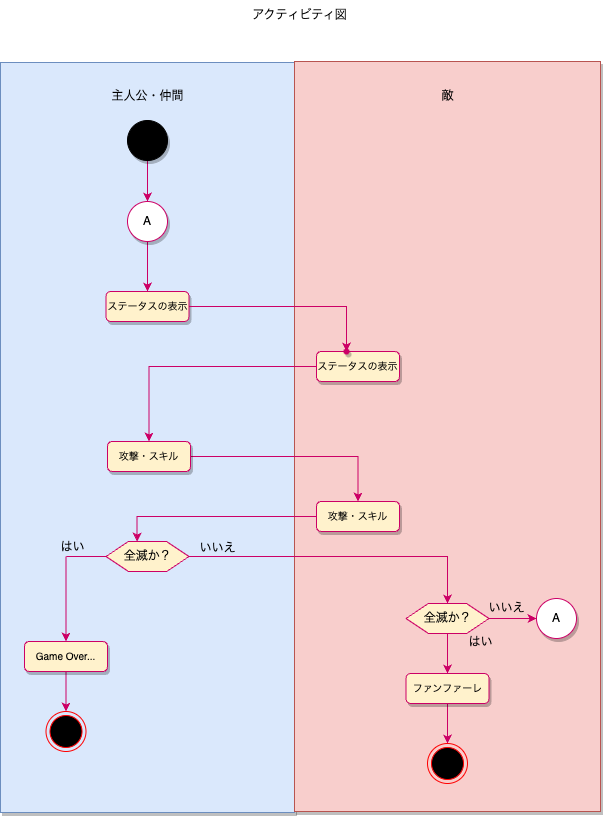

# オブジェクト指向でRPG風 CLI

## アクティビティ図

## 要件定義
- 敵(複数)と主人公・仲間が戦う
- それぞれのキャラクター(敵含む)は異なるHP・攻撃力・魔法攻撃力を持つ
- 主人公・仲間はジョブという役割を持っており、スキルが使用可
- ジョブは「勇者」「黒魔導士」「白魔道士」
- ターン制バトル
- 攻撃対象はランダム。(敵もランダムで攻撃)ただし、すでにHPが0のキャラクタはー対象から除外
- ジョブを持つキャラクターは通常攻撃とは別に一定確率でスキルを発動する
- 主人公・仲間 => 敵の順で行動する
- どちらかのパーティが全滅するまで戦う